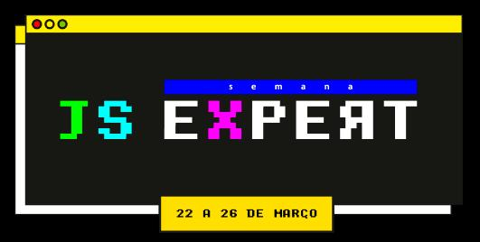

## HACKER CHAT by Gilles

<h1 align="center">
  <p align="center" style="background: #5429cc">
    
  </p>

  <h3 align="center">
   App developed during the training of the primary chapter of JS Expert Week 03. Server.
  </h3>
  <p align="center">
     
      
      
      
      
      
  </p>
</h1>

<p align="center">
  <a href="#page_with_curl-sobre">About</a>&nbsp;&nbsp;&nbsp;|&nbsp;&nbsp;&nbsp;
  <a href="#books-requisitos">Requirements</a>&nbsp;&nbsp;&nbsp;|&nbsp;&nbsp;&nbsp;
  <a href="#rocket-começando">Starting</a>&nbsp;&nbsp;&nbsp;|&nbsp;&nbsp;&nbsp;
  <a href="#gear-iniciando-back-end">Node.js</a>&nbsp;&nbsp;&nbsp;|&nbsp;&nbsp;&nbsp;
</p>

## :page_with_curl: About

Hacker Chat is an application developed during the week JS expert 03, an application that you chat in a multiplatform chat in an incredible way, using only the terminal.

Lessons of the Week JS Expert 3.0 Building a multiplatform chat using command line and Advanced JavaScript.

**Node.js**:Used to run the application.

**JS**: Programming language used to develop the chat.

## :books: Requirements

- To have [**Git**](https://git-scm.com/) to clone the project.
- To have [**Node.js**](https://nodejs.org/en/) installed.
- To have [**NPM**](https://www.npmjs.com/) installed.

## :rocket: 🎧🕹Starting

```bash
  # Clone the project:
  $ git clone https://github.com/Gilles30/hacker-chat-gilles-server

  # Enter Directory:
  $ cd hacker-chat-gilles-server

  # Enter Directory:
  $ cd client

  # Install the dependencies:
  $ npm i

  # Running app:
  $ npm start

```

:computer:

## Preview

<p size=3>
  
</p>

## 👨🏻‍🚀 About me

<a href="https://www.linkedin.com/in/lorison-gilles/">
 
 <p>Lorison Gilles</p>
</a>
<br>

Made with love 💜 by [Lorison Gilles](https://github.com/Gilles30) 🖖🏻👾☕
